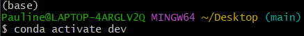
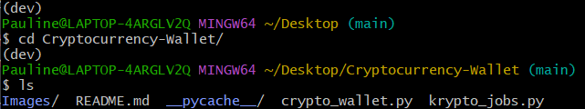
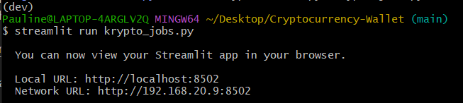
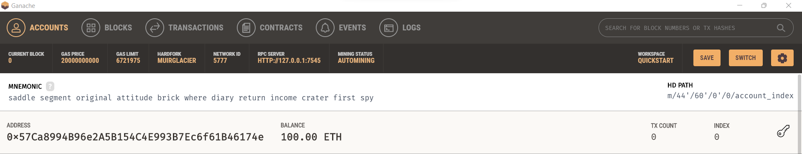
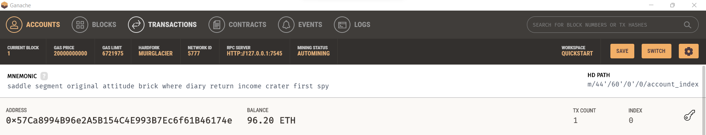
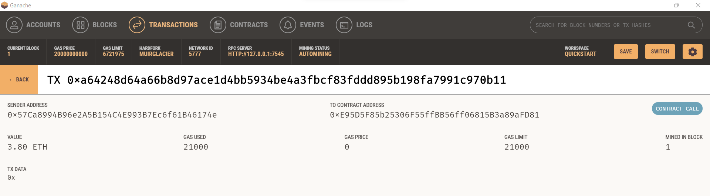
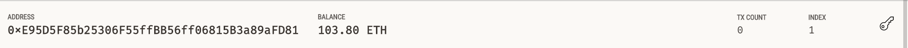

# Cryptocurrency-Wallet

## Background
I work at a startup that is building a new and disruptive platform called KryptoJobs2Go. KryptoJobs2Go is an application that its customers can use to find fintech professionals from among a list of candidates, hire them, and pay them. As KryptoJobs2Go’s lead developer, I have been tasked with integrating the Ethereum blockchain network into the application in order to enable your customers to instantly pay the fintech professionals whom they hire with cryptocurrency.
I have completed the code that enables my customers to send cryptocurrency payments to fintech professionals. To develop the code and test it out, I have assumed the perspective of a KryptoJobs2Go customer who is using the application to find a fintech professional and pay them for their work.

## Environment Set Up
In order to run the user-friendly web interface successfully, it is recommended to install the streamlit library in a seperate environment. The users should open a terminal instance, and activate their Conda development environment.

Then the users need to install the streamlit library by running the following command in the terminal:

`pip install streamlit`

Then the users can confirm the installation by running the following command:

`conda list streamlit`

The users need to add their mnemonic seed phrase (provided by Ganache) to the starter code’s `SAMPLE.env` file. When the information has been added, rename the file `.env`.

## Running the Streamlit Application
First, the users need to go into the folder which contains the python file `krypto_jobs.py` and `crypto_wallet.py`.

Then the users can run the Streamlit application by using the `streamlit run krypto_jobs.py` command in the terminal. The messages similar to the ones in the screenshot should be shown:

The users now should be able to use the Streamlit web application.

## Using the Streamlit Application
1. On the resulting webpage, select a candidate that you would like to hire from the appropriate drop-down menu. Then, enter the number of hours that you would like to hire them for.

2. Click the Send Transaction button to sign and send the transaction with your Ethereum account information. 

3. Navigate to Ganache. Take my account in Ganache as an example:

    I had 100 Ether before the transaction

    

    Then after my transaction with Jo, this is what my account on Ganache shows. You can see the balance now shows 96.20 ETH.

    

    Under the `Transactions` tab on Ganache, you can see the transaction I just made with Jo.

    

    Finally, as I used one of my other address for Jo for testing purpose. You can see that the recipient (Jo)'s account balance has also gone up by 3.80 ETH.

    

